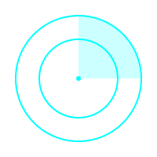

# ⚡ System.initialize("moment-NEW")

<p align="center">
  
</p>

## 🤖 [Mission Control]
> **Identity**: Engineering Student @ HDU  
> **Objective**: Building better robots and sharing the journey.

---

### 📊 系统运行状态 (System Status)
| 模块 (Module) | 状态 (Status) | 进度 (Progress) |
| :--- | :--- | :--- |
| **Sentry 优化** | 🛠️ Maintenance |  |
| **高电流快插设计** | 🔌 Prototyping |  |
| **ROS2 学习** | 📚 Learning |  |
| **Kalman 滤波** | 📐 Math Heavy |  |
| **Linux 马拉松** | 🏃 Running |  |
| **Debug Framework** | 👨‍💻 Refactoring |  |

---

### 🛠 核心插件库 (Tech Stack)
```cpp
struct Developer {
    string roles[] = {"RoboMaster Developer", "Embedded Engineer", "Linux Enthusiast"};
    string tools[] = {"C++", "Python", "STM32", "ROS2", "Altium Designer"};
    string current_focus = "Kalman Filter & Shell Implementation";
};
```

<p align="left">
  
  
  
  
  
</p>

---

### 📈 活跃度分析 (Activity)
[等待施工】  
---

### 🛰️ 建立连接 (Connect with me)
```bash
$ ping moment-new.hdu.edu.cn
# 正在等待信号反馈...
```
- 📧 Email: [你的邮箱]
- 💬 愿意交流关于 RM 算法、硬件选型或 Linux 的任何话题。

---

<p align="center">
  
</p>
  
<p align="center">
  
  <br>
  <b>Sentry Radar Active</b>
</p>
